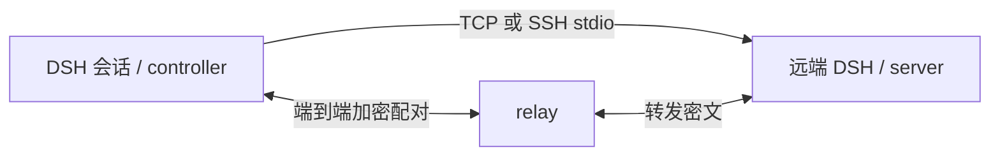

# DSH Native Env v2

将一个 DSH 会话连接到另一台机器的 DSH 工具环境。进入远端后，工具调用交给远端运行时执行；退出后回到本机。连接断开时，挂起调用报错并移除远端工具映射，重连不会重放旧调用，需要重新进入环境。

本仓库包含插件源码、独立配对 relay、跨平台安装脚本和自动化测试。它是本机开发版本的脱敏发布副本，版本为 `0.1.0`；不包含机器凭据、配对状态、运行日志或实机测试配置。插件仍处于早期阶段，目标 DSH 版本为 **0.1.7-rc.2**，Node.js **20 或以上**。



## 功能与组件

| 组件 | 作用 | 默认状态 |
| --- | --- | --- |
| `dsh-native-env-v2` | controller、会话进入/退出、配对和设置页 | 启用，连接配置为空 |
| `dsh-native-env-v2/server` | 提供当前机器的 DSH 工具环境 | 关闭 |
| `dsh-native-env-v2/public` | 内嵌 relay + Cloudflare Quick Tunnel | 关闭 |
| `dsh-native-env-v2/full` | 放开桥接默认工具排除项 | 关闭 |

- 支持 v2 的 `env2/hello`、工具目录、能力/修订号协商、调用、取消及工具变更通知，也保留 `env/*` 兼容层。
- 支持 SSH stdio、认证 TCP，以及邀请链接/二维码/设备码配对。
- 设置页提供连接状态、配对和组件状态；`env_status`、`env_enter`、`env_exit`、`env_invite` 可在会话中使用。
- `public` 只公开配对 relay 的 WebSocket 端点。首次使用可能下载官方 `cloudflared`；可以通过 `cloudflaredPath` 指定已有程序。
- `full` 保留本地退出控制和配置中的 `exclude`，权限仍由远端 DSH 与操作系统决定。UI、附件等工具的调用可序列化转发，但不提供远端窗口或附件引用适配。

## 安装插件

1. 将 `plugins/dsh-native-env-v2` 整个目录复制到固定位置，例如 Windows 的 `C:/dsh-plugins/dsh-native-env-v2` 或 Linux 的 `/opt/dsh-plugins/dsh-native-env-v2`。
2. 在目标 DSH profile 的补丁中加入 controller/server 行，参考 `examples/controller.patch.yml` 和 `examples/server.patch.yml`。将示例中的路径改成实际**包目录绝对路径**。controller 用包根入口，以便 DSH 同时发现浏览器组件。
3. 重启或按 profile 的重载策略重载 DSH。controller 的设置入口位于 **设置 → DSH Native Env v2**。
4. 在 controller 上配置双方可访问的同一个 relay；本机试用可在仓库根目录执行 `node relay/main.js`，对应地址为 `ws://127.0.0.1:8931/v2/relay`。跨机器使用时需改为可达地址，公开部署使用 TLS。
5. 在设置页接受配对说明，创建邀请或设备卡；在提供工具的机器上连接该邀请。设备码模式应核对双方显示的六位短码。连接成功后，通过 `env_status` 查看 peer，再执行 `env_enter({"peer":"<peer-name>"})`。执行 `env_exit({})` 返回本机。

若通过 DSH 插件管理器导入本地包，可使用插件自带的 `cordis.patch.yml`。内置补丁的 controller 初始没有 relay/peer/listener，server、public、full 均默认关闭。示例行应与现有行合并，避免重复加载 controller。

### SSH 与 Windows guest

SSH stdio 适合已配置 SSH 登录的机器，不需要桥接 TCP 令牌。在 guest 上复制完整插件目录后：

```sh
DSH_NATIVE_ENV_DIR=/opt/dsh-plugins/dsh-native-env-v2 \
  bash /opt/dsh-plugins/dsh-native-env-v2/bin/guest-install.sh --verify
```

该脚本创建/维护专用 `env` profile，并使用 `dsh-base`。SSH 主机配置见 `examples/ssh-controller.patch.yml`。不要让 ACP stdio 服务与环境桥接共用 stdout。guest 上需要已有可用的 DSH 和 `dsh` 命令。

Windows guest 可使用 `bin/guest-install.ps1` 和 `bin/guest-run-standalone.ps1`；详见脚本头部参数说明。TCP 共享令牌应放在本机文件或环境变量中，通过 `tokenFile`/`tokenEnv` 引用。不要提交真实令牌。

## 开发与验证

运行时代码只依赖 Node 内置模块，不需要安装 npm 运行时依赖。开发依赖 `qrcode` 仅用于对 QR 编码器进行独立比对，不随插件运行。

安装 Node.js 和 pnpm 11.7.0 后，在仓库根目录执行：

```sh
pnpm install --frozen-lockfile
pnpm check
pnpm test
```

也可以不安装开发依赖直接执行：

```sh
node scripts/check-publication.mjs
node scripts/test.mjs
```

未安装 `qrcode` 时，四项独立 QR 比对测试会跳过；其余测试仍运行。测试使用内存通道、本机临时目录和 loopback relay，不连接原开发机器或云实例。GitHub Actions 在 Windows/Linux 上检查源码并运行完整测试。

`check` 检查 JavaScript 语法以及常见令牌、私钥、个人 Windows 路径、非示例 IPv4 和本机状态文件。它只报告文件位置，不打印匹配值；它是发布检查的补充，不能替代人工审查。

## 独立 relay

```sh
node relay/main.js
```

默认监听 `127.0.0.1:8931`，健康检查为 `/healthz`。部署配置、TLS、nginx、systemd 和协议说明见 [relay 文档](relay/README.md)。从仓库根目录构建 Docker 镜像：

```sh
docker build -f relay/Dockerfile -t dsh-native-env-relay .
docker run --rm -p 127.0.0.1:8931:8931 dsh-native-env-relay
```

relay 可以看到连接地址、邀请槽、消息大小和时间，并在邀请有效期内持有 rendezvous secret；工具调用 payload 使用端到端加密。指纹邀请与手输设备码的信任方式不同，详见 relay 文档。正式部署需要自行提供可用 relay 或启用 `public`，仓库不提供公共服务地址。

## 目录

```text
plugins/dsh-native-env-v2/   插件、浏览器组件、locale、guest 安装脚本和测试
relay/                      独立 relay、Dockerfile、systemd 配置及测试
examples/                   通用 controller/server/SSH 配置
scripts/                    测试入口和发布检查
.github/workflows/          Windows/Linux 持续集成
```

脱敏范围与发布验证说明见 [PUBLISHING.md](PUBLISHING.md)。许可证为 [MIT](LICENSE)。
